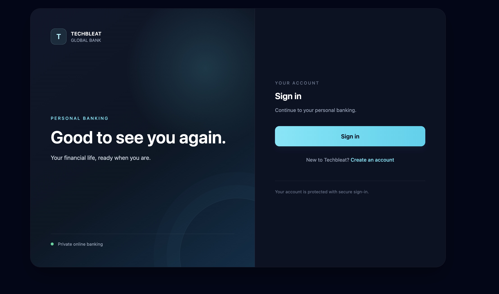
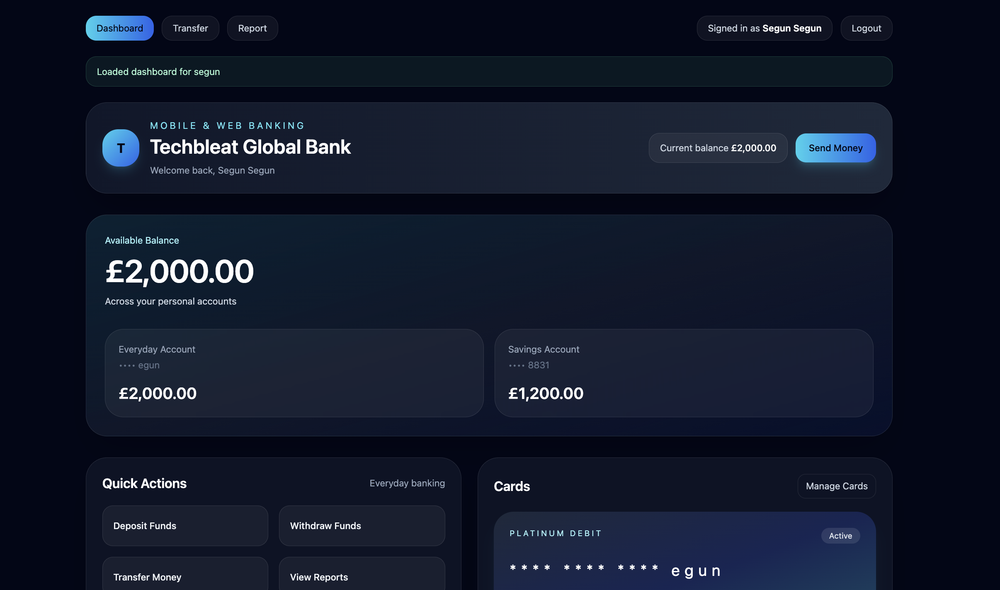

# Techbleat Global Bank

A proof-of-concept digital banking platform with a React customer experience and backend services for customer profiles, accounts, transactions, and activity history.

## Project Layout

- `techbleat-global-bank-frontend/` — React/Vite sign-in, registration, dashboard, transfers, and reports.
- `techbleat-global-bank-backend/` — FastAPI user and activity services, Spring Boot transaction service, database setup, and Docker Compose configuration.

## Visual Overview

The customer experience uses a deep slate background, cyan highlights, restrained gradients, and high-contrast typography. Sign-in is focused; the dashboard groups account balances, quick actions, and recent activity for scanning.

### Sign In



### Banking Dashboard



## Prerequisites

- Docker with Docker Compose v2.24 or newer
- Node.js 18 or newer if running the frontend outside Docker
- Keycloak running in the `banking` realm

## Run with Docker Compose

From the repository root:

```sh
cd techbleat-global-bank-backend
docker compose up --build
```

The frontend is served at `http://localhost:3000`. Before using registration, configure `KEYCLOAK_ADMIN_CLIENT_SECRET` in an untracked `.env` file beside the backend `docker-compose.yml`. The Keycloak URL defaults to `http://host.docker.internal:8080` for Docker Desktop.

The FinanceAgent is served at `http://localhost:9001`; signed-in customers with the `banking-ai-agent` role can open it from the **AI Assistant** button in the frontend. The frontend proxies agent requests through its web origin. To enable chat, copy `finance-agent/.env.example` to `finance-agent/.env` and set `OPENAI_API_KEY`; the agent container loads that file when present. The file is excluded from the container image. Configure the Keycloak audience for authenticated agent requests, as described in the agent README.

Check service health at:

- User service: `http://localhost:8000/health`
- Transaction service: `http://localhost:8090/health`
- Activity service: `http://localhost:8001/health`
- FinanceAgent: `http://localhost:9001/health`

## Run the Frontend Separately

Start the backend services first, then run:

```sh
cd techbleat-global-bank-frontend
npm ci
npm run dev
```

Vite serves the frontend at `http://localhost:3000` and proxies `/user-api`, `/transaction-api`, and `/activity-api` to the backend services. If Keycloak uses port `8080`, the transaction service is exposed on host port `8090` to avoid a port conflict.

## Keycloak Configuration

Use the `banking` realm and configure these clients:

- `banking-frontend`: public OpenID Connect client; client authentication off, standard flow on, PKCE method `S256`. Add the frontend origin and trailing-slash redirect URI to the client’s allowed origins and redirect URIs.
- `banking-provisioner`: confidential backend client with service accounts enabled. Assign its service account the `realm-management` → `manage-users` client role. Keep its client secret in the backend environment only; never put it in frontend variables.

The app registration form collects a user ID, name, email, and password. The user service provisions the Keycloak identity, bank profile, and zero-balance account. The initial password is temporary, so Keycloak requires a password change at first sign-in. The app currently accepts passwords of at least three characters; Keycloak realm password policy may impose additional requirements.

An administrator must assign `banking-customer` after registration before the user can access banking. `banking-transact` additionally enables deposits, withdrawals, and transfers. Assign `banking-ai-agent` to users who should see and use the AI Assistant. The frontend accepts these as realm roles or as roles assigned to the `banking-frontend` client. This AI role currently gates the frontend UI only; the FinanceAgent API still relies on token validation and has no role check.

## API Overview

| Service | Base URL | Main endpoints |
| --- | --- | --- |
| User | `http://localhost:8000` | `GET /health`, `GET /users`, `POST /users` |
| Transaction | `http://localhost:8090` | `GET /health`, `GET /balance/{userId}`, `GET /transactions/{userId}`, `POST /transactions/deposit`, `POST /transactions/withdraw`, `POST /transactions/transfer` |
| Activity | `http://localhost:8001` | `GET /health`, `GET /activities/{userId}` |

Registration uses `POST /users` with `id`, `full_name`, `email`, and `password`. Transaction write requests use the `X-User-Id` header.

## Security Notes

- This is a proof of concept. Banking APIs do not yet validate bearer-token signatures, issuer, audience, or required roles. Frontend role checks are not server-side authorization; add validation in each protected API before using real customer data or transactions.
- Email verification and signup rate limiting are not currently implemented.
- The three-character minimum password is for development only and is not appropriate for real accounts.
- Never commit `.env` files, Keycloak client secrets, or secret manifests.
